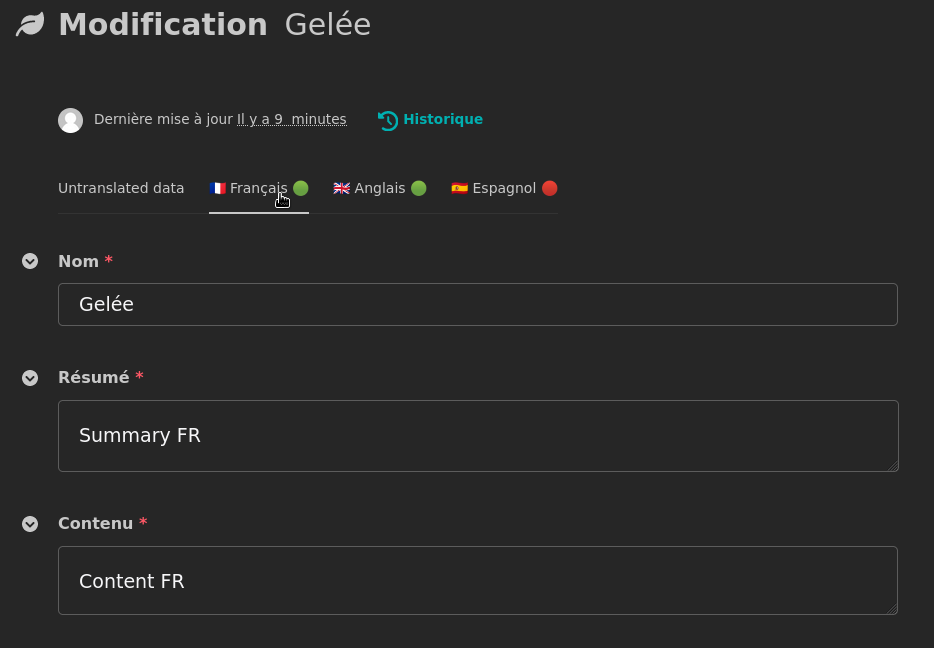

# Wagtail ModelAdmin Parler 🧀 🐦 

[](https://pypi.org/project/wagtail-modeladmin-parler/)


[](https://github.com/psf/black)

[](https://mypy-lang.org/)
[](https://pycqa.github.io/isort/)
[](https://semver.org/)
[](https://wagtail-modeladmin-parler.readthedocs.io/en/latest/?badge=latest)

Brings "omelette du fromage" 🧀 from parler into wagtail 🐦 via modeladmin

Wagtail ModelAdmin Parler (WMP) helps you to use `django-parler` with `wagtail-modeladmin` to 
manage your custom models and translations.



## Tests, QA, consistency and compatibility

This app is tested to runs with:

* Django 3.2, 4.2
* Wagtail TODO
* Parler TODO
* Python 3.7, 3.9, 3.11

To ensure code quality and consistency:

* Formatted with [black](https://pypi.org/project/black/)
* Validated with [flake8](https://pypi.org/project/flake8/). 
* Static types checked with [mypy](https://pypi.org/project/mypy/)
* Tests coverage checked with [coverage](https://pypi.org/project/coverage/) (100% tested)
* Tests runned in local via [tox](https://pypi.org/project/tox/) and on github via [github actions workflow](https://docs.github.com/en/actions/using-workflows)
* versionned with [semver](https://semver.org) logic

## Why

There is already an internationalisation support in wagtail via their own language features called [wagtail-localize](https://www.wagtail-localize.org/). 
This app [also support wagtail modeladmin](https://www.wagtail-localize.org/how-to/modeladmin/).
But the approach of wagtail-localize could be unconvenient as translations are stored in the same
table than "main instances", resulting specific queryset and managers to manage your models.  
For app's like treebeard, it can break the logic of your tree.

For those reasons, some people as us prefer to use django-parler as translations approach. If it's
your preferance too, "wagtail modeladmin parler" will fit to you: it will allow you to use 
django-parler to translate your own models and still have a usefull wagtail modeladmin interface to
manage translations.

## Installation

Install the package via pip. We consider you already have django-parler and wagtail installed.

`pip install wagtail-modeladmin-parler`

Then, in settings.py, add `wagtail_modeladmin_parler` to the installed apps.

```python
# settings.py

INSTALLED_APPS = [
    # …
    "wagtail_modeladmin_parler",
    # …
]
```

## Basic Usage


You just have to add `ParlerModelAdminMixin` to your `ModelAdmin`, *et voilà*, you are ready to 
eat *omelette du fromage*.

```python
from wagtail.contrib.modeladmin.options import ModelAdmin
from wagtail_modeladmin_parler.handlers import ParlerModelAdminMixin
from .models import Food


class FoodAdmin(ParlerModelAdminMixin, ModelAdmin):
    model = Food
```


## Extra 🧀🐦

More advanced usage, tests, etc., are documented [in the doc](https://readthedocs.org/projects/wagtail-modeladmin-parler/badge/?version=latest).

> Maître [Wagtail][wagtail], sur un arbre perché,  
> Tenait en son bec une omelette du fromage.  
> Maître [Webu][webu], à l'envie de [parler][parler],  
> Lui tint à peu près ce langage :  
> Et bonjour, Monsieur [Wagtail][wagtail].  
> Que de beaux commits ! quelle merveille !  
> Sans mentir, si votre codage  
> Se rapporte à votre plumage,  
> Vous êtes le Phénix des hôtes de ces dépots.
> …

From « Le Corbeau et le Renard » by Jean de La Fontaine, 1668.

[wagtail]: https://docs.wagtail.org/en/stable/index.html
[parler]: https://django-parler.readthedocs.io/en/stable/index.html
[webu]: https://www.webu.coop
