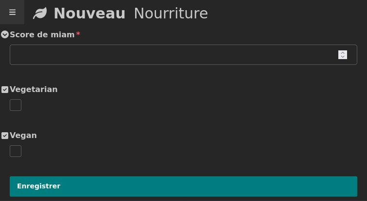
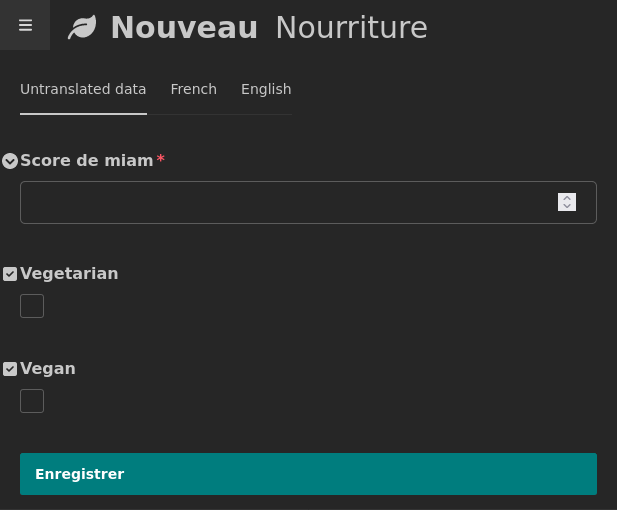
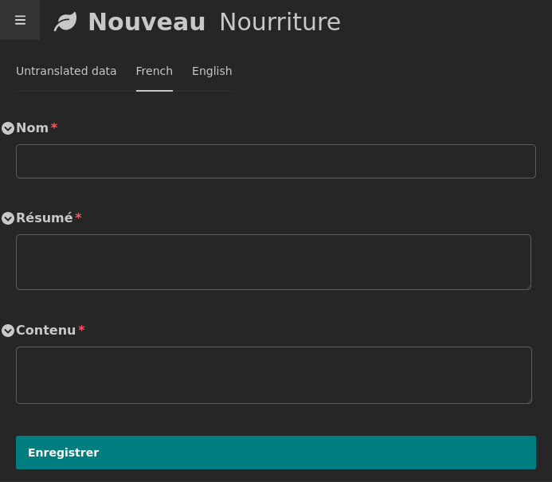
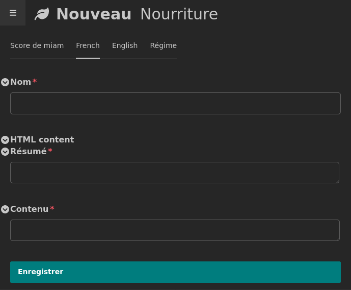
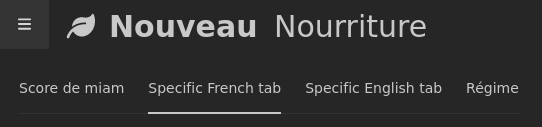
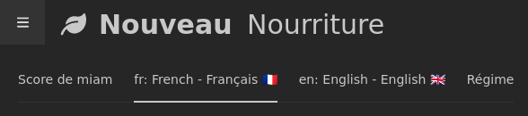

# Usage

First, be sure to have a valid settings to use multiple languages with parler. ex:

## Basics

### Settings

```python
# settings.py

INSTALLED_APPS = [
    ...
    "wagtail_parler",
    "parler",
]
LANGUAGE_CODE = "fr"
PARLER_LANGUAGES = {
    None: ({"code": "fr", }, {"code": "en", },),
    "default": {
        "fallbacks": [LANGUAGE_CODE],
        "hide_untranslated": False,
    },
}
```

### Create a TranslatableModel

Let's start with a model `TranslatableModel` `Food`. 
Nothing special, it's a normal [django-parler][django-parler] `TranslatableModel` with its translations

```python
# models.py

from django.db import models
from django.utils.translation import gettext_lazy as _
from parler.models import TranslatableModel
from parler.models import TranslatedFields


class BaseFood(TranslatableModel):
    yum_rating = models.PositiveSmallIntegerField(
        verbose_name=_("Score de miam"), blank=False, null=False
    )
    vegetarian = models.BooleanField(
        verbose_name=_("Vegetarian"),
        blank=False,
        null=False,
        default=False,
    )
    vegan = models.BooleanField(
        verbose_name=_("Vegan"),
        blank=False,
        null=False,
        default=False,
    )
    translations = TranslatedFields(
        name=models.CharField(_("Nom"), max_length=255, blank=False, null=False),
        summary=models.TextField(_("Résumé"), blank=False, null=False),
        content=models.TextField(_("Contenu"), blank=False, null=False),
    )

    class Meta:
        verbose_name = _("Nourriture")
        verbose_name_plural = _("Nourritures")

    def __str__(self) -> str:
        return self.safe_translation_getter("name", any_language=True)
```

### Create a default Admin interface

Know, let's create the [wagtail `SnippetViewSet`][snippet] (or [wagtail `ModelAdmin`][modeladmin]) to manage this Model.

```python
# wagtailhooks.py

from wagtail.snippets.views.snippets import SnippetViewSet
from wagtail.snippets.models import register_snippet
from .models import Food

class FoodAdmin(SnippetViewSet):
    model = Food

register_snippet(FoodAdmin)


# Or for ModelAdmin:

from wagtail.contrib.modeladmin.options import ModelAdmin, modeladmin_register
from .models import Food

class FoodAdmin(ModelAdmin):
    model = Food

modeladmin_register(FoodAdmin)
```

At this stage, if you go the admin interface to create a new `Nourriture`, you'll only get standard fields displayed, in the order where they are added in your models (rating, vege, vegan):




### Add auto tabs for languages via ParlerSnippetAdminMixin (or ParlerModelAdminMixin)

Tranlatable fields are not yet displayed. To add tabs for translations, you just
had to extends `ParlerSnippetAdminMixin` (or `ParlerModelAdminMixin` for ModelAdmin):


```python
# wagtailhooks.py
from wagtail.snippets.views.snippets import SnippetViewSet
from wagtail.snippets.models import register_snippet
from wagtail_parler.handlers import ParlerSnippetAdminMixin
from .models import Food

class FoodAdmin(ParlerSnippetAdminMixin, SnippetViewSet):
    model = Food

register_snippet(FoodAdmin)


# or for an usage with wagtail-modeladmin:

from wagtail.contrib.modeladmin.options import ModelAdmin, modeladmin_register
from wagtail_parler.handlers import ParlerModelAdminMixin
from .models import Food

class FoodAdmin(ParlerModelAdminMixin, ModelAdmin):
    model = Food

modeladmin_register(FoodAdmin)
```

This time, you'll see 3 tabs (if you set 2 languages). First one will contain fields wich are shared between all translations (rating, vege, vegan). Then a tab for each configured language 
will be added to translate the language dependant fields (name, summary, content).

## Untranslated data tab



## Language tab




## Use Model.panels

You can use `panels` attribute of your Model to customise the order of the fields or group them 
together for exemple:


```python
# models.py

...

class BaseFood(TranslatableModel):
    ...
    panels = [
        FieldPanel("yum_rating"),
        ObjectList(
            heading=_("Régime"), children=[FieldPanel("vegetarian"), FieldPanel("vegan")]
        )
    ]
    ...
```

## Use edit_handler from Model or ModelAdmin

`wagtail-parler` supports all ways to define your ModelAdmin's edit_handlers.  
You can customize non-translated fields as you want. 

```python
# models.py

...

class BaseFood(TranslatableModel):
    ...
    panels = [
        FieldPanel("yum_rating"),
        ObjectList(
            heading=_("Régime"), children=[FieldPanel("vegetarian"), FieldPanel("vegan")]
        )
    ]
    ...
```


## Customize handlers of the translated fields with `TranslationsList`

Of course, `wagtail-parler` let you customize what is in language tabs.  
To do this, you'll define a `TranslationsList` inside your `edit_handler`. 
It will be used as a template to generate all languages tabs. 

```python
# wagtail_hooks.py

from wagtail.admin.panels import FieldPanel
from wagtail.admin.panels import ObjectList
from wagtail.contrib.modeladmin.options import ModelAdmin
from wagtail.contrib.modeladmin.options import modeladmin_register

from wagtail_parler.handlers import ParlerModelAdminMixin
from wagtail_parler.handlers import TranslationsList

from .models import Food


class FoodAdmin(ParlerModelAdminMixin, ModelAdmin):
    model = Food
    edit_handler = ObjectList(
        children=[
            FieldPanel("yum_rating"),
            # translations tabs will be inserted here, between "yum_rating" and "Régime".
            TranslationsList(
                children=[
                    # Each translation tab will use those handlers
                    FieldPanel("name"),
                    ObjectList(
                        heading="HTML content",
                        children=[
                            FieldPanel("summary"),
                            FieldPanel("content"),
                        ]
                    ),
                ],
            ),
            ObjectList(
                heading=_("Régime"), children=[FieldPanel("vegetarian"), FieldPanel("vegan")]
            ),
        ],
    )

modeladmin_register(FoodAdmin)
```

Now, translations tabs will be set between tabs "Score de miam" (`yum_rating`) and "Régime" (specific objectlist grouping `vegetarian` and `vegan` fields).  
Furthermore, we also organized content of each language tab by grouping fields `summary` and 
`content` below a "HTML Content" group.



## Personalize language tab lables

Those settings are designed to personlize all language tabs for all your `ParlerModelAdminMixin`:

* `WAGTAIL_PARLER_DEFAULT_TAB_HEADING`
* `WAGTAIL_PARLER_DEFAULT_TAB_HEADING_UNSTRANLATED`
* `WAGTAIL_PARLER_DEFAULT_TAB_HEADING_TRANLATED`

But if you want a really specific tab label for one ParlerModelAdminMixin, you can set the label to use in the `TranslationsList` heading:

```python
# wagtail_hooks.py

...


class FoodAdmin(ParlerModelAdminMixin, ModelAdmin):
    model = Food
    edit_handler = ObjectList(
        children=[
            FieldPanel("yum_rating"),
            # translations tabs will be inserted here, between "yum_rating" and "Régime".
            TranslationsList(
                heading="Specific %(locale)s tab",
                children=[
                ]
            )
            ...
        ]
    )
```

`%(locale)s` will always be available as var replacement.





All others keys inside each language confiuration dict of PARLER_LANGUAGES (`PARLER_LANGUAGES[None][<lang_offset>]`) will also be available, so do not hesitate to add your customs inside it.

```python
# settings.py

PARLER_LANGUAGES = {
    None: (
        {
            "code": "fr",
            "translated_label": _("Français"),  # custom add
            "untranslated_label": "Français",  # custom add
            "utf8_flag": "🇫🇷",  # custom add
        },
        ...
    )
    ...
}
```

```python

...
            TranslationsList(
                heading="%(code)s: %(locale)s - %(untranslated_label)s %(utf8_flag)s",
                ...
            )
...
```



[wagtail]: https://docs.wagtail.org/en/stable/index.html
[snippet]: https://docs.wagtail.org/en/stable/topics/snippets/
[modeladmin]: https://docs.wagtail.org/en/stable/reference/contrib/modeladmin/index.html
[django-parler]: https://django-parler.readthedocs.io/en/stable/
